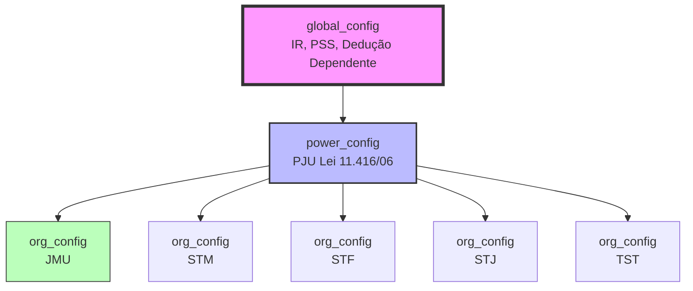

# 📚 Resumo Completo do Projeto: Salário do Servidor

**Data de Atualização:** 23 de Janeiro de 2026  
**Projeto:** Calculadora de Salários do Poder Judiciário da União  
**Status:** Em Desenvolvimento Ativo

---

## 📋 Índice

1. [Visão Geral](#visão-geral)
2. [Tecnologias Utilizadas](#tecnologias-utilizadas)
3. [Arquitetura Atual](#arquitetura-atual)
4. [Trabalho Realizado](#trabalho-realizado)
5. [Estado Atual](#estado-atual)
6. [Próximos Passos](#próximos-passos)
7. [Como Continuar o Desenvolvimento](#como-continuar-o-desenvolvimento)
8. [Deploy e Produção](#deploy-e-produção)

---

## 🎯 Visão Geral

### Objetivo do Projeto

Sistema web para cálculo preciso de salários e benefícios de servidores do Poder Judiciário da União (PJU), especialmente da Justiça Militar da União (JMU). O sistema calcula:

- **Vencimentos Base**: Analistas e Técnicos Judiciários
- **Gratificações**: GAJ, GAE, GAS, Funções Comissionadas (FC1-FC6)
- **Adicional de Qualificação (AQ)**: Sistema antigo (até 2025) e novo (2026+)
- **Benefícios**: Auxílio Alimentação, Pré-Escolar, Transporte
- **Rendimentos Variáveis**: Férias, 13º Salário, Hora Extra, Substituição, Diárias, Licença Compensatória
- **Descontos**: PSS, IRRF, Funpresp

### Problema Resolvido

Antes da refatoração, o sistema tinha **valores hardcoded** espalhados pelo código, dificultando manutenção e atualizações. A solução implementada centraliza todos os dados no **Supabase**, criando um sistema **data-driven** com hierarquia de configuração em 3 níveis.

---

## 🛠️ Tecnologias Utilizadas

### Frontend
- **React 18.3** com TypeScript
- **Vite** como bundler
- **TailwindCSS** para estilização
- **Lucide React** para ícones
- **React Router DOM** para navegação

### Backend/Database
- **Supabase** (PostgreSQL)
  - Tabelas: `global_config`, `power_config`, `org_config`
  - Autenticação e Row Level Security (RLS)

### Bibliotecas de Exportação
- **jsPDF** + **jspdf-autotable** para geração de PDFs
- **xlsx** para exportação Excel
- **file-saver** para download de arquivos

### Deploy
- **Vercel** (Produção e Preview)
- **GitHub** para versionamento

---

## 🏗️ Arquitetura Atual

### Estrutura de Pastas

```
salario-do-servidor/
├── src/
│   ├── components/
│   │   └── Calculator/          # 21 componentes atômicos
│   │       ├── VacationCard.tsx
│   │       ├── ThirteenthCard.tsx
│   │       ├── OvertimeCard.tsx
│   │       ├── DailiesCard.tsx
│   │       ├── LicenseCard.tsx
│   │       ├── SubstitutionCard.tsx
│   │       ├── FoodAllowanceCard.tsx
│   │       ├── PreschoolCard.tsx
│   │       └── ... (13 outros componentes)
│   │
│   ├── services/
│   │   └── agency/
│   │       ├── types.ts                    # Interfaces principais
│   │       └── implementations/
│   │           └── JmuService.ts           # Lógica de cálculo (817 linhas)
│   │
│   ├── core/
│   │   └── calculations/
│   │       └── taxUtils.ts                 # Cálculos de PSS e IRRF
│   │
│   ├── utils/
│   │   ├── config-utils.ts                 # Helpers de configuração
│   │   └── calculations.ts                 # Utilitários de cálculo
│   │
│   ├── hooks/
│   │   └── useCalculator.ts                # Hook principal do estado
│   │
│   ├── pages/
│   │   └── Calculator.tsx                  # Página principal
│   │
│   └── configTypes.ts                      # TypeScript types para config
│
├── migrations/
│   └── create-hierarchical-config.sql      # Migração SQL principal
│
└── public/
    └── jmu_old/                            # Calculadora legada (backup)
```

### Arquitetura Hierárquica de Configuração



**Lógica de Merge:**
```
org_config > power_config > global_config
```

Configurações mais específicas sobrescrevem as mais genéricas.

---

## ✅ Trabalho Realizado

### Fase 1: Atomização do Layout (20/01/2026)

**Objetivo:** Quebrar componentes grandes em cards atômicos reutilizáveis.

**Componentes Criados:** 8 cards principais
- `VacationCard.tsx` - Férias (1/3 Constitucional)
- `ThirteenthCard.tsx` - Gratificação Natalina (13º)
- `SubstitutionCard.tsx` - Substituição de Função
- `LicenseCard.tsx` - Licença Compensatória
- `OvertimeCard.tsx` - Serviço Extraordinário (HE)
- `DailiesCard.tsx` - Diárias de Viagem
- `FoodAllowanceCard.tsx` - Auxílio Alimentação
- `PreschoolCard.tsx` - Auxílios e Benefícios

**Novo Layout:** Grid de 3 colunas (Rendimentos Fixos | Rendimentos Variáveis | Descontos)

**Benefícios:**
- ✅ Modularidade e reutilização
- ✅ Manutenibilidade simplificada
- ✅ Testabilidade individual
- ✅ Código mais limpo e organizado

### Fase 2: Correção de Valores Históricos (20/01/2026)

**Problema:** Valores de 2025 estavam incorretos no código.

**Correção Aplicada:**

| Benefício | Valor Incorreto | Valor Correto | Fonte |
|-----------|-----------------|---------------|-------|
| Auxílio Alimentação 2025 | R$ 1.182,74 | **R$ 1.393,10** | PJU Oficial |
| Auxílio Pré-Escolar 2025 | R$ 935,22 | **R$ 1.178,82** | PJU Oficial |

**Arquivo Modificado:** [JmuService.ts](file:///c:/Users/jtnas/.gemini/antigravity/scratch/salario-do-servidor/src/services/agency/implementations/JmuService.ts#L190-L206)

### Fase 3: Planejamento da Arquitetura Hierárquica (20/01/2026)

**Decisão:** Adotar tabelas separadas no banco de dados para criar hierarquia de configuração em 3 níveis.

**Níveis Definidos:**

1. **`global_config`** - Regras comuns (IR, PSS, Dedução Dependente)
2. **`power_config`** - Regras do PJU (Lei 11.416/06)
3. **`org_config`** - Regras específicas por órgão (JMU, STM, etc.)

### Fase 4: Implementação SQL (20/01/2026)

**Tabelas Criadas:**

#### 1. `global_config`
- **Registros:** 3
  - `ir_deduction` - Deduções de IR (2024-2026)
  - `pss_tables` - Tetos RGPS e alíquotas progressivas
  - `dependent_deduction` - R$ 189,59

#### 2. `power_config`
- **Registros:** 6 (todos para PJU)
  - `cj1_integral_base` - R$ 10.990,74 (base para VR)
  - `salary_bases` - Bases salariais Analista/Técnico + FC1-FC6
  - `adjustment_schedule` - Reajustes 2026-2028 (3× 8%)
  - `gratification_percentages` - GAJ (140%), GAE/GAS (35%)
  - `aq_rules` - Sistema antigo e novo de AQ
  - `benefits` - Histórico de Auxílio Alimentação e Pré-Escolar

#### 3. `org_config`
- **Registros:** 5 organizações
  - JMU (Justiça Militar da União)
  - STM (Superior Tribunal Militar)
  - STF (Supremo Tribunal Federal)
  - STJ (Superior Tribunal de Justiça)
  - TST (Tribunal Superior do Trabalho)

**Arquivo de Migração:** [create-hierarchical-config.sql](file:///c:/Users/jtnas/.gemini/antigravity/scratch/salario-do-servidor/migrations/create-hierarchical-config.sql)

**Status:** ✅ Executado com sucesso no Supabase (20/01/2026)

---

## 📊 Estado Atual

### Componentes Implementados

**Total:** 21 componentes React

**Principais:**
- `Calculator.tsx` - Página principal
- `IncomeSection.tsx` - Seção de rendimentos fixos
- `VariableIncomeSection.tsx` - Seção de rendimentos variáveis
- `DeductionsSection.tsx` - Seção de descontos
- `ResultsSummary.tsx` - Resumo de resultados
- `ActionFooter.tsx` - Ações (PDF, Excel, Limpar)

### Estrutura de Dados no Banco

**Supabase Tables:**

```sql
-- Configuração Global (3 registros)
global_config (id, config_key, config_value, valid_from, valid_to)

-- Configuração por Poder (6 registros PJU)
power_config (id, power_name, config_key, config_value, valid_from, valid_to)

-- Configuração por Organização (5 registros)
org_config (id, org_slug, org_name, power_name, configuration)
```

### Funcionalidades Disponíveis

✅ **Cálculos Completos:**
- Vencimento Base + GAJ
- Funções Comissionadas (FC1-FC6)
- AQ Antigo (percentual) e Novo (VR × multiplicador)
- Gratificações Específicas (GAE/GAS)
- VPNI (Lei e Decisão Judicial) + ATS
- Abono de Permanência
- Férias (1/3 Constitucional) com IR
- 13º Salário (Adiantamento + Parcela Final)
- Hora Extra (50% e 100%)
- Substituição de Função
- Diárias de Viagem (com glosas e deduções)
- Licença Compensatória
- PSS (Progressivo com teto RGPS)
- IRRF (Progressivo com dependentes)
- Funpresp (Obrigatório + Facultativo)

✅ **Exportação:**
- PDF com layout oficial
- Excel (XLSX)

✅ **Períodos Suportados:**
- Período 0: 2025 (valores históricos)
- Período 1: 2026 (Fev-Jun)
- Período 2: 2026 (Jul-Dez) - Reajuste +8%
- Período 3: 2027 (Jul-Dez) - Reajuste acumulado +16,64%
- Período 4: 2028 (Jul-Dez) - Reajuste acumulado +25,97%

---

## 🚀 Próximos Passos

### Fase 5: Integração TypeScript com ConfigService (PENDENTE)

**Objetivo:** Refatorar `JmuService` para buscar dados do Supabase em vez de usar valores hardcoded.

#### 5.1. Criar `ConfigService.ts`

```typescript
class ConfigService {
  async getEffectiveConfig(orgSlug: string): Promise<EffectiveConfig> {
    // 1. Buscar global_config ativo
    const global = await this.fetchGlobalConfig();
    
    // 2. Buscar org_config e descobrir power_name
    const org = await this.fetchOrgConfig(orgSlug);
    
    // 3. Buscar power_config baseado no power_name
    const power = await this.fetchPowerConfig(org.power_name);
    
    // 4. Deep merge: global < power < org
    return this.deepMerge(global, power, org.configuration);
  }
}
```

#### 5.2. Refatorar `JmuService.ts`

**Mudanças Necessárias:**

```typescript
// ANTES (Hardcoded)
const BASES_2025 = {
  salario: { analista: { 'A1-1': 10990.74, ... }, ... },
  funcoes: { fc1: 1976.36, ... }
};

// DEPOIS (Data-Driven)
class JmuService {
  private configService: ConfigService;

  async calculateBase(params: IJmuCalculationParams): Promise<number> {
    const config = await this.configService.getEffectiveConfig('jmu');
    const salaryBases = this.getSalaryBasesForPeriod(
      config.bases_salariais,
      config.reajustes_salariais,
      params.periodo
    );
    // ... resto do cálculo usando config
  }
}
```

**Arquivos a Modificar:**
- [JmuService.ts](file:///c:/Users/jtnas/.gemini/antigravity/scratch/salario-do-servidor/src/services/agency/implementations/JmuService.ts) (linhas 70-102)
- Criar `src/services/config/ConfigService.ts`
- Atualizar `useCalculator.ts` para usar async

### Fase 6: Testes e Validação (PENDENTE)

**Checklist de Testes:**

- [ ] Testar cálculos para período 0 (2025)
- [ ] Testar cálculos para período 1-4 (2026-2029)
- [ ] Validar reajustes aplicados corretamente
- [ ] Verificar herança de configurações (org > power > global)
- [ ] Comparar resultados com holerites oficiais
- [ ] Testar exportação PDF e Excel
- [ ] Validar responsividade mobile

### Fase 7: Limpeza de Código Legado (PENDENTE)

**Constantes a Remover:**

```typescript
// Remover de JmuService.ts e calculations.ts
BASES_2025
CJ1_INTEGRAL_BASE
HISTORICO_PSS
HISTORICO_IR
DEDUCAO_DEP
```

**Ações:**
- [ ] Remover constantes hardcoded
- [ ] Depreciar métodos antigos
- [ ] Atualizar documentação inline
- [ ] Adicionar comentários explicativos

### Fase 8: Melhorias Futuras

**Funcionalidades Planejadas:**

1. **Admin Panel**
   - Interface para atualizar configurações sem SQL
   - Histórico de mudanças
   - Versionamento de configurações

2. **Multi-Órgão**
   - Suporte completo para STM, STF, STJ, TST
   - Seletor de órgão na UI

3. **Autenticação**
   - Login para servidores
   - Salvamento de perfis
   - Histórico de cálculos

4. **Relatórios**
   - Comparação entre períodos
   - Projeção de reajustes
   - Análise de impacto de mudanças

---

## 💻 Como Continuar o Desenvolvimento

### Configuração do Ambiente Local

```bash
# 1. Clonar o repositório
git clone <repo-url>
cd salario-do-servidor

# 2. Instalar dependências
npm install

# 3. Configurar variáveis de ambiente
# Copiar .env.local.example para .env.local
# Adicionar credenciais do Supabase

# 4. Rodar localmente
npm run dev
```

### Padrões de Código

**Componentes React:**
- Usar TypeScript estrito
- Props tipadas com interfaces
- Componentes funcionais com hooks
- Nomes descritivos (PascalCase)

**Serviços:**
- Classes com métodos privados
- Injeção de dependências via construtor
- Retornos tipados com interfaces
- Comentários JSDoc

**Utilitários:**
- Funções puras quando possível
- Testes unitários para lógica complexa
- Exports nomeados

### Fluxo de Trabalho Git

```bash
# 1. Criar branch para feature
git checkout -b feature/nome-da-feature

# 2. Fazer commits atômicos
git add .
git commit -m "feat: descrição clara da mudança"

# 3. Push para GitHub
git push origin feature/nome-da-feature

# 4. Criar Pull Request
# Revisar e fazer merge
```

### Estrutura de Commits

Seguir [Conventional Commits](https://www.conventionalcommits.org/):

- `feat:` Nova funcionalidade
- `fix:` Correção de bug
- `refactor:` Refatoração sem mudança de comportamento
- `docs:` Atualização de documentação
- `style:` Formatação de código
- `test:` Adição de testes
- `chore:` Tarefas de manutenção

---

## 🌐 Deploy e Produção

### Configuração Vercel

**Arquivo:** [vercel.json](file:///c:/Users/jtnas/.gemini/antigravity/scratch/salario-do-servidor/vercel.json)

```json
{
  "rewrites": [
    {
      "source": "/(.*)",
      "destination": "/index.html"
    }
  ]
}
```

**Variáveis de Ambiente (Vercel Dashboard):**

```
VITE_SUPABASE_URL=https://fdzuykiwqzzmlzjtnbfi.supabase.co
VITE_SUPABASE_ANON_KEY=<chave-anon>
```

### Processo de Deploy

**Automático (via GitHub):**

```bash
# 1. Fazer push para main
git push origin main

# 2. Vercel detecta e faz deploy automático
# 3. Preview disponível em <branch>.vercel.app
# 4. Produção em <projeto>.vercel.app
```

**Manual (via Vercel CLI):**

```bash
# 1. Instalar Vercel CLI
npm i -g vercel

# 2. Login
vercel login

# 3. Deploy
vercel --prod
```

### Validação Pós-Deploy

**Checklist:**

- [ ] Acessar URL de produção
- [ ] Testar calculadora com diferentes configurações
- [ ] Verificar se dados do Supabase estão sendo carregados
- [ ] Validar exportação PDF e Excel
- [ ] Testar em diferentes navegadores
- [ ] Validar responsividade mobile

---

## 📚 Documentação Adicional

### Arquivos de Referência

**Documentação Técnica:**
- [DOCUMENTACAO_REFATORACAO_2026-01-20.md](file:///c:/Users/jtnas/.gemini/antigravity/scratch/salario-do-servidor/DOCUMENTACAO_REFATORACAO_2026-01-20.md) - Refatoração completa
- [PROJECT_ARCHITECTURE.md](file:///c:/Users/jtnas/.gemini/antigravity/scratch/salario-do-servidor/PROJECT_ARCHITECTURE.md) - Arquitetura do projeto
- [DESIGN_SYSTEM.md](file:///c:/Users/jtnas/.gemini/antigravity/scratch/salario-do-servidor/DESIGN_SYSTEM.md) - Sistema de design

**Guias de Atualização:**
- [COMO_ATUALIZAR.md](file:///c:/Users/jtnas/.gemini/antigravity/scratch/salario-do-servidor/COMO_ATUALIZAR.md) - Como atualizar o projeto
- [GUIA_ATUALIZACAO_BANCO.md](file:///c:/Users/jtnas/.gemini/antigravity/scratch/salario-do-servidor/GUIA_ATUALIZACAO_BANCO.md) - Como atualizar o banco

**Validações:**
- [VALIDACAO_VALORES_OFICIAIS.md](file:///c:/Users/jtnas/.gemini/antigravity/scratch/salario-do-servidor/VALIDACAO_VALORES_OFICIAIS.md) - Validação de valores
- [VALIDACAO_REAJUSTES_2026-2028.md](file:///c:/Users/jtnas/.gemini/antigravity/scratch/salario-do-servidor/VALIDACAO_REAJUSTES_2026-2028.md) - Validação de reajustes

**Análises Técnicas:**
- [ANALISE_AQ_AUXILIAR_GRADUACAO.md](file:///c:/Users/jtnas/.gemini/antigravity/scratch/salario-do-servidor/ANALISE_AQ_AUXILIAR_GRADUACAO.md) - Análise AQ
- [CORRECAO_AUXILIAR_JUDICIARIO.md](file:///c:/Users/jtnas/.gemini/antigravity/scratch/salario-do-servidor/CORRECAO_AUXILIAR_JUDICIARIO.md) - Correção Auxiliar

### Base Legal

- **Lei 11.416/2006** - Carreiras dos Servidores do PJU
- **Lei 15.292/2025** - Novo sistema de AQ baseado em VR
- **Portaria CJF** - Tabelas de remuneração

---

## 🎉 Conclusão

O projeto **Salário do Servidor** evoluiu significativamente, passando de um sistema com valores hardcoded para uma arquitetura **data-driven** robusta e escalável. A refatoração de 20/01/2026 estabeleceu bases sólidas para:

✅ **Manutenção Simplificada** - Atualizações via SQL, sem deploy  
✅ **Escalabilidade** - Suporte a múltiplos poderes e órgãos  
✅ **Precisão** - Fonte oficial única, reduz erros  
✅ **Auditoria** - Histórico completo de mudanças  
✅ **Flexibilidade** - Hierarquia de override clara  

O sistema está pronto para evoluir e atender às necessidades de todos os órgãos do Poder Judiciário da União.

---

**Última Atualização:** 23/01/2026 12:45  
**Versão:** 2.0  
**Autor:** Equipe de Desenvolvimento
